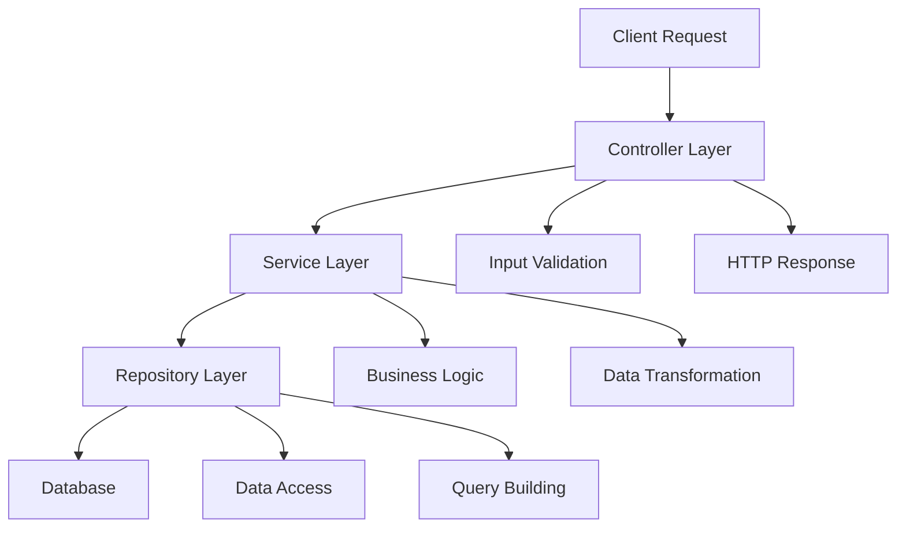

## DECISIONS 🔄
This document outlines key architectural decisions and technology choices made for the **Honya Books** application.

### Frontend
- `Next.js`: Decided to use Next.js for the frontend because it gives many features out of the box. For example: Routing, Caching, Server Actions to efficiently interact with the backend, and many more.
- `React Hook Form`: Used to handle form states with minimal re-renders and pairing it with Zod to validate form data facilitated a better developer experience.

### Backend
- `Go + Fiber`: Fiber offers a quick and minimalistic way to build a RESTful API. It's easy to get a middleware up and running with Fiber (*Rate Limiter, Logger, etc*).
- `Clean Architecture`: Controller, Service, Repository Pattern is used to keep the code clean and maintainable. It helps in writing more readable and testable code.
- `Base Reposiory`: Implemented a *Base Repository* for a better code organization and to avoid code duplication.
- `AWS S3`: Used to store the book cover images. Simpler and cheaper way to store files. 
- `Testing`: Used Testify to write unit tests for the backend that tests controller, service, and repository layers.

#### Clean Architecture Diagram

<br/>

**Layer Responsibilities:**
- 🎯 **Controller**: HTTP handling, validation, response formatting
- 🧠 **Service**: Business logic, data processing, orchestration
- 💾 **Repository**: Database operations, query management

### Application Structure 📁

```bash
honya/                              # Root Project Directory
│
├── backend/                        
│   ├── api/index.go                # Application Entry Point for Production
│   ├── config/                     # Environment & Configuration
│   ├── controller/                 # HTTP Request Handlers
│   ├── dto/                        # Data Transfer Objects
│   ├── middleware/                 # Rate Limiting, Logging, CORS
│   ├── model/                      # Database Models (GORM)
│   ├── repository/                 # Database Operations & Queries
│   ├── router/                     # API Route Definitions
│   ├── service/                    # Business Logic Layer
│   ├── tests/                      # Unit & Integration Tests
│   ├── utils/                      # Helper Functions & Utilities
│   ├── docs/                       # Swagger Documentation
│   └── main_local.go               # Application Entry Point for Local Development
│
├── frontend/                       # Next.js Frontend
│   ├── src/
│   │   ├── actions/               # Server Actions (Next.js)
│   │   ├── app/                   # App Router & Pages
│   │   ├── components/            # Reusable UI Components
│   │   ├── lib/                   # Utility Libraries & Configs
│   │   ├── stores/                # State Management (Zustand)
│   │   └── types/                 # TypeScript Type Definitions
│   ├── public/                    # Static Assets
│   ├── locales/                   # Internationalization Files
│   └── package.json               # Dependencies & Scripts
│
├── docs/                          # Project Documentation
│   ├── API.md                     # API Documentation
│   ├── SCHEMA.md                  # Database Schema
│   ├── SETUP.md                   # Setup Instructions
│   └── DECISIONS.md               # Architecture Decisions
│
├── docker-compose.yml             # Docker Services Configuration
├── Makefile                       # Build & Development Scripts
└── README.md                      # Project Overview
```

## Conclusion 🎯
The output / conclusion can be found in the [Screenshots](./SCREENSHOTS.md) file.