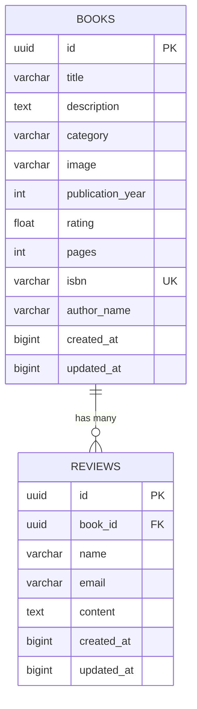

## Database Schema 🫙

This document outlines the database schema for the Honya Books Application.

### Models
#### 1. Books Model 📚

#### Schema Structure

| Field | Type | Constraints | Description |
|-------|------|-------------|-------------|
| `id` | UUID | Primary Key, Auto-generated | Unique book identifier |
| `title` | VARCHAR(255) | **Required** | Book title |
| `description` | TEXT | Optional | Detailed book description |
| `category` | VARCHAR(100) | Optional | Book genre/category |
| `image` | VARCHAR(255) | Optional | URL to book cover image |
| `publication_year` | INTEGER | Optional | Year the book was published |
| `rating` | FLOAT | Optional | Book rating (typically 0-5 scale) |
| `pages` | INTEGER | Optional | Number of pages in the book |
| `isbn` | VARCHAR(20) | **Unique** | International Standard Book Number |
| `author_name` | VARCHAR(100) | Optional | Primary author name |
| `created_at` | BIGINT | Auto-generated | Unix timestamp of creation |
| `updated_at` | BIGINT | Auto-updated | Unix timestamp of last update |

#### 2. Reviews Model 📝

#### Schema Structure

| Field | Type | Constraints | Description |
|-------|------|-------------|-------------|
| `id` | UUID | Primary Key, Auto-generated | Unique review identifier |
| `book_id` | UUID | **Required**, Foreign Key | Reference to the reviewed book |
| `name` | VARCHAR(100) | **Required** | Reviewer's display name |
| `email` | VARCHAR(100) | **Required** | Reviewer's email address |
| `content` | TEXT | **Required** | Review content/text |
| `created_at` | BIGINT | Auto-generated | Unix timestamp of creation |
| `updated_at` | BIGINT | Auto-updated | Unix timestamp of last update |

#### 3. Database Relationships Diagram

#### 4. Common Operations

#### 4.1 Books
- List and filter books
- Search books
- View book details and reviews
- Add, update and delete books

#### 4.2 Reviews
- Get all reviews for a specific book
- List reviews across all books
- Add a new review